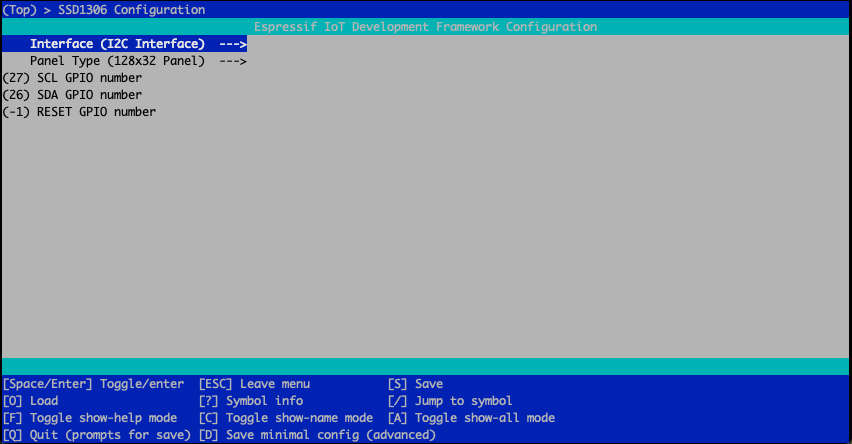
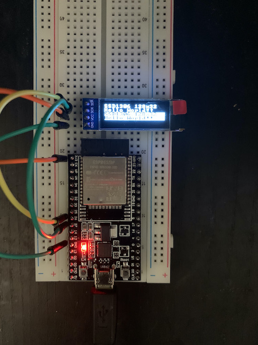

# SSD1306 Driver for ESP-IDF

This is based on the code from [nopnop2002's SSD1306 library](https://github.com/nopnop2002/esp-idf-ssd1306). There are lots of libraries out there and Espressif has a sample in their ESP IOT library. The Espressif one however drags in lot of other code that I had no use for, and other libraries only supported the I2C one. This version works, but was setup as a sample project. I moved the files around so it can be included as a component to any ESP-IDF project. This version also supported the ESP32-S2 chip out of the box.

Apparently, code was based on:
* [repository as a reference](https://github.com/yanbe/ssd1306-esp-idf-i2c)   
* [font file](https://github.com/dhepper/font8x8)  

## Installation for IDF project

Checkout the code as a submodule:

```
mkdir components
git submodule add https://github.com/mbuckaway/esp-idf-ssd1306
idf.py menuconfig
idf.py build
idf.py build
```

For the ESP32-S2 chip, the process is the same, except, you have to set the target first. This is nothing special about this code for the S2 chip, however.

## Config Variables

You have to set this config value with menuconfig.
- CONFIG_INTERFACE
- CONFIG_PANEL
- CONFIG_SDA_GPIO
- CONFIG_SCL_GPIO
- CONFIG_RESET_GPIO
- CONFIG_MOSI_GPIO
- CONFIG_SCLK_GPIO   
- CONFIG_CS_GPIO
- CONFIG_DC_GPIO




See the original repo is you want to see sample images for projects based on the driver.

## Building the example

The code is setup as a componment to be used in your application. To build the example, go into the example directory, and run the following:

```
cd example
idf.py menuconfig
idf.py build
idy.py flash
```

The example will build and be flashed into your device. The example was changed from the original to loop forever and provide logging on the serial console. Useful if you happen to incorrectly setup the GPIO pins.

The example is show running in the photo below.




## Fonts

The basic 8x8 font is provided. The source of the font is from [Daniel Hepper's font8x8 repo](https://github.com/dhepper/font8x8). Other extended fonts are available for such things as European characters, box display, etc. Read font8x8_basic.h for details on how to transport the original font files to use with the SSD1306.

## Usage

The best way to figure out how to use component is to refer to example and the ssd1306.h. The API is straight forward.
